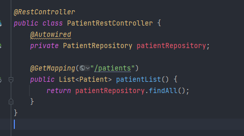

# apprentissageJEE
progression de mon apprentissage du JEE. Sur recommandation, je travaille essentiellement (sauf précision inverse) avec JAVA 8
Le dossier test-Servlet contient seulement quelques tests que j'ai effectué en suivant un tutoriel de chez JetBrains afin de voir le fonctionnement 
d'un serveur JEE avec glassfish et n'a en lui-même pas grand intérêt.
Les exercices sont listés ici dans leur ordre de réalisation, du plus ancien (le premier que j'ai effectué) au plus récent (le dernier), 
montrant mon évolution dans l'utilisation des différents outils. L'ordre dans le dépot étant alphabétique, ce readme pourra vous aider à voir l'ordre 
dans lequel j'ai travaillé les concepts, framework et autres outils dans mon apprentissage du JEE.
Vous verrez parfois la présence de dépendance a h2 database, beaucoup de ces exercices ayant été réalisé de prime abord 
via l'outil h2 avant de passer aux BDD mysql (techniquement, mariaDB).
Vous trouverez parfois dans les captures d'écran ainsi que -beaucoup plus- dans le code, si vous le parcourez, des bloc de code 
mis en commentaire, ainsi que mes propres commentaires servant de prise de notes.
Si l'intérêt du second est assez évident pour moi en terme -justement- de prise de notes, le premier peut l'être un peu moins.
Il s'agit en général soit d'une première version d'une fonctionnalité, d'une méthode, etc; qui a demandé à être ré-adapté, utilisée différemment
ou autre, mais dont j'ai voulu conserver l'ancienne version afin de pouvoir m'en rappeler, l'utiliser ou l'améliorer, ou simplement de pouvoir avoir une trace
de ce que j'ai fait et de son évolution, pour comparaison.

# inversion_controle
Ce dossier concerne la partie apprentissage du principe d'inversion de controle et d'injection des dépendances. 
J'y approfondis ma connaissance et mon utilisation des interfaces, afin de créer des applications fermées à la modification et ouvertes à l'extension.
Le principe est d'utiliser ici un petit fichier de configuration en txt afin de définir la classe d'implémentation à utiliser et, ici, la classe d'extension à utiliser.:

utilisation dans le fichier Pres2.java, ou le fichier de configuration est lu afin de faire fonctionner l'exemple d'application avec les fichiers précisé.

Cet exercice n'avait pour but que l'utilisation de quelques fonctions Java (comme le Class.forName()) et de présenter le principe d'inversion de contrôles.

# inv-conv-maven
inv-con-maven repose sur le même principe mais en utilisant un projet et une configuration maven.
L'exercice est sensiblement le même que le précédent, profitant des possibilités que maven apporte, comme l'utilisation du pom.xml, ou de quelques annotations via spring.

L'essentiel des deux exemples utilisés ici.

# jpa-appr
Ici, mon premier exercice spring-boot. Utilisation des annotations fournies par lombok, de spring DATA JPA

ici une entité créée grace aux annotations de lombok notamment, permettant de définir les getter et setter ainsi que les constructeur, et l'annotation @Entty pour la persistence

Ici un repository, définissant des méthodes utilisant la nomenclature fournie par spring DATA JPA, ainsi qu'une méthode utilisant du HQL

L'application.properties utilisé ici

# hospital
Une déclinaison plus poussée de l'exercice précédent, comprenant plusieurs entitées avec relations, plusieurs repository associés, et la création d'un
petit controller Rest renvoyant les données en JSON, les fetchType, les enumérations, l'annotation transactionnal de spring, etc

une entité avec relation du projet / exercice

L'interface du service utilisé dans l'application, avec la définition des méthodes utilisées

le début de l'implémentation de l'interface montrée ci-dessus

Le petit RestController crée afin de consulter les données en bdd en JSON(associés aux annotation JSON dans l'entité 
correspondante, cf l'entité RendezVous)

# jpa-manytomany
Même principe que l'exercice précédent, avec l'utilisation cette fois-ci d'une relation ManyToMany et la définition de la JoinTable et JoinColumn (cf screen suivant)

Comme il s'agit d'une projet mettant en scène des rôles et des utilisateurs, j'ai également anticipé l'utilisation d'un PasswordEncoder avec Bcrypt pour le stockage des mots de passe.

# mvcthymeleaf
mvcthymeleaf consiste en quelques exercices et tests en rendu côté serveur sur un petit projet avec des patients, en utilisant le moteur de template thymeleaf.
Il compile la grande partie de ce que j'ai fait précédemment, avec -outre l'utilisation de thymeleaf- mais aussi de l'utilisation de spring security avec 
WebSecurityConfigurerAdapter, avec un package dédié à la sécurité.

Une des deux méthodes configure du security config, avec l'utilisation de l'objet HttpSecurity

L'utilisation de l'interface UserDetailsService et de l'objet User de spring security

Une partie du controller Patient, avec quelques méthodes d'affichage de certaines pages

Le layout utilisé dans le rendu, contenant notamment le header et le footer, et l'utilisation des fragments

Un formulaire rendu avec thymeleaf, et l'utilisation des balises th:value, th;method, etc...

Le rendu ici dans chrome, le design n'est pas très recherché et est plutôt minimaliste(mais n'était pas le but de l'exercice), la pagination, la fonction recherche
et les formulaires de modification d'ajout et la suppression sont fonctionnels et se basent sur les rôles de l'utilisateur authentifié.
(si vous voulez tester, les utilisateurs sont précisé dans MvcThymeleafApplication)

# spsec-jwt

# e-banking
